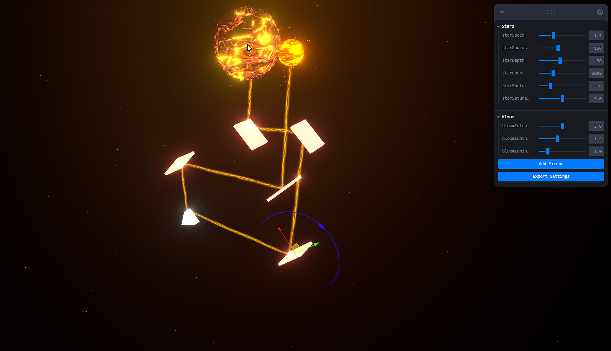

# Mirror Laser Project (Work in progress)



This project is a React application built with Vite, featuring a 3D environment using React Three Fiber. It includes a minimal setup for Hot Module Replacement (HMR) and ESLint rules for code quality.

## Features

- Interactive 3D scenes with customizable objects like mirrors and triangles.
- Real-time updates and effects using post-processing techniques.
- Responsive design with Tailwind CSS for styling.
- State management for object editing and positioning.

## Official Plugins

This project utilizes the following Vite plugins:

- [@vitejs/plugin-react](https://github.com/vitejs/vite-plugin-react/blob/main/packages/plugin-react/README.md): Uses [Babel](https://babeljs.io/) for Fast Refresh.
- [@vitejs/plugin-react-swc](https://github.com/vitejs/vite-plugin-react-swc): Uses [SWC](https://swc.rs/) for Fast Refresh.

## Getting Started

To get started with the project, clone the repository and install the dependencies:

```bash
git clone <repository-url>
cd <project-directory>
npm install
```

Then, you can run the development server:

```bash
npm run dev
```

## Building for Production

To build the project for production, use:

```bash
npm run build
```

## Linting

To lint the code, run:

```bash
npm run lint
```

## License

This project is licensed under the MIT License.
